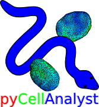
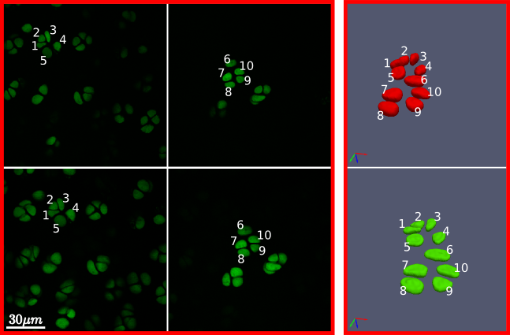
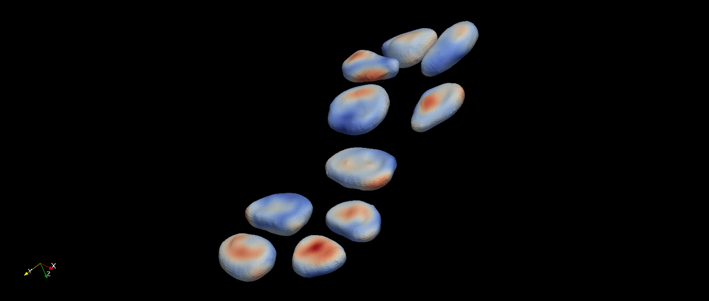

.. pyCellAnalyst documentation master file, created by
   sphinx-quickstart on Fri Nov  6 09:57:06 2015.
   You can adapt this file completely to your liking, but it should at least
   contain the root `toctree` directive.

Welcome to pyCellAnalyst's documentation!
=========================================

.. toctree::
   :maxdepth: 2
   :numbered:

   installation
   introduction
   classes

pyCellAnalyst is a Python module aimed at the segmentation of cells imaged with 3-D microscopy under different mechanical conditions, and then quantifying the deformations resulting from those conditions. Many image processing, segmentation, and registration methods from the extensive and powerful *C++* Visualization and Simple Insight Toolkits are provided. With these tools, objects in challenging configurations can be segmented in 3-D.

   Cells reconstructed from dual photon laser scanning microscopy data in an unloaded (top) and loaded state (bottom). The challenge of separating highly clustered objects is handled robustly by the tools provided.

Following object segmentation, the resulting polygonal surfaces in reference and deformed states can be used to calculate cellular deformations. Three methods are provided for this: equivalent principal moments of inertia ellipsoid, optimal affine transformation, and deformable image registration (more details in Introduction). The results of deformable image registration applied to the example object segmentation above is visualized below.

   A visualization of the optimal diffeomorphism mapping the reconstructed referece (red) and deformed (green) cells in the previous figure is shown here. This is one of three methods to characterize deformation provided within pyCellAnalyst. 

