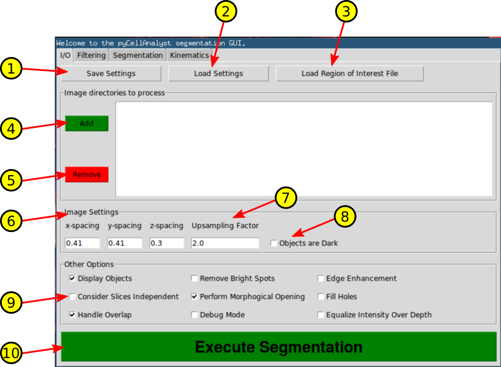
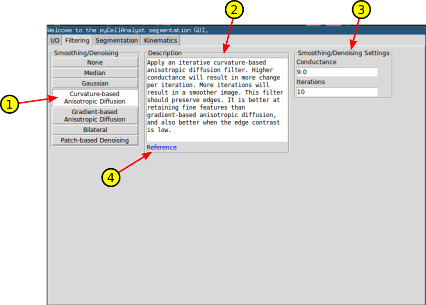
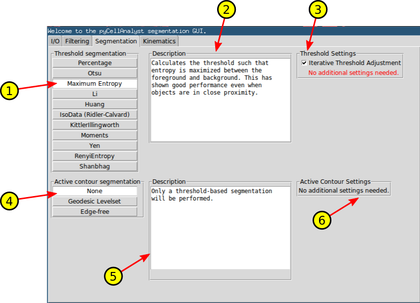

Segmentation and Analysis Graphical User Interface
==================================================

A graphical user interface (GUI) is packaged within the pyCellAnalyst module to allow for access to all features without a need for a knowledge of the Python language.
To start the GUI, open a command terminal anywhere and type:

.. code-block:: guess

   python -m pyCellAnalyst.GUI

An example analysis video using ImageJ and this GUI can be found `here <https://youtu.be/ICasGix1Omo>`_.

.. toctree::
   :maxdepth: 1
   :glob:

I/O Tab - Input and Output, Segmentation Execution, Extra Options
-----------------------------------------------------------------

1. Save settings used in current analysis to a Python pickle file.
2. Load settings from a previously saved Python pickle file.
3. Load an Excel (.xls) file containing region of interest definitions for each image directory.

   * All regions of interest applicable to a specific image directory must be on a individual sheets.
   * The sheets must be in the order that the image directories are added.
4. Add and the path to a directory containing the images.

   * Directories must be added corresponding to the order of the sheets in the region of interest file.
   * Directory paths will appear in the white box to the right after addtion.
5. Remove selected directory from the list.
6. Physical dimensions of image voxels.

   * If there is a necessary correction physical dimensions of the voxels, e.g., for laser scanning microscopy the z-spacing should be adjusted to account for depth distortion,  please account for it here.
7. Upsample the image by this factor. This can help when an active contour model is employed.
8. Check *Objects are Dark* if the objects of interest appear darkest in the image.
9. Other options for the image processing and segmentation.

   * *Display Objects* - If checked will spawn a 3-D interactive rendering of the reconstructed objects with label indicated by color.
   * *Remove Bright Spots* - Will replace bright spots greater than or equal to the 98:sup:`th` percentile intensity.
   * *Edge Enhancement* - Enhance the edges in each region of interest using Laplacian sharpening.
   * *Consider Slices Independent* - Perform processing and segmentation on each slice in stack independently in 2-D and reassemble results. This is not recommended except for specialized cases.
   * *Perform Morphological Opening* - If checked will perform a single voxel erosion followed by a single voxel dilation. This will remove islands and spurious connections with typically negligible effects on the segmentation. If the object of interest has exceptionally thin features it may be necessary to disable this.
   * *Fill Holes* - If checked all holes completely internal to the segmented objects will be filled.
   * *Handle Overlap* - If checked a support vector machine classification will be performed if any objects overlap.
   * *Debug Mode* - Outputs addtional images to disk for debugging purposes (smoothed image, seed images for active contour models).
   * *Equalize Intensity Over Depth* - Performs a linear correction of intensity changes with depth, so all slices are of similar intensity.
10. Perform the segmentation.

Filtering Tab - Image Smoothing and Denoising Methods
-----------------------------------------------------

1. Image smoothing and denoising methods.
2. A brief description of the currently selected method, and general advice on its use.
3. The adjustable parameters for the currently selected method.
4. Hyperlinks to the appropriate theoretical reference if available. This requires and internet connection and will open in the OS default web browser.

Segmentation Tab - Object Segmentation and Display
--------------------------------------------------

1. Thresholding method that can either serve as the complete segmentation method, or provide the initial seed for an active contour model.
2. Brief description of the currently selected thresholding method.
3. Threshold settings for currently selected method. All by the *Percentage* method require no additional settings.

   * If *Iterative Threshold Adjustment* is checked, the threshold will be adjusted until the thresholded object no longer touches the edge of the region of interest definition.
4. Selection of active contour model to use.
5. Brief description of the currently selected active contour model with general advice on its usage.
6. Adjustable parameters for the currently selected active contour model.

Kinematics Tab - Deformation Analysis Methods
---------------------------------------------

.. image:: ./img/tab4_annotated.png
   :align: center

1. Load the directory containing the polygonal surfaces resulting from object segmentation of the reference state.
2. Load each directory containing segmented surfaces for each deformed state.
3. Remove the selected deformed directory(ies) from the list.
4. Options for the deformation analysis.

   * Before performing the optimization to determine the best affine transformation between objects, will first find the optimal rigid body translation and rotation to align objects if checked.
   * If checked, perform deformable image registration to find the best non-uniform deformation that maps the reference to the deformed object(s).
   * If checked, save 3-D mesh information and displacements calculated by deformable image registration interpolated to the mesh boundary to a Python pickle file that can later be used to fully generate and solve finite element analyses of the the deformation.
   * If checked, spawns a 3-D interactive rendering of the non-uniform displacements resulting from deformable image registration. The deformation can be animated by pressing the RIGHT-ARROW. Also, the frames of the animation can be saved to disk by pressing the UP-ARROW.
   * If checked, bar plots of the results from the ellipsoidal and affine transformation methods reporting cell strains.

